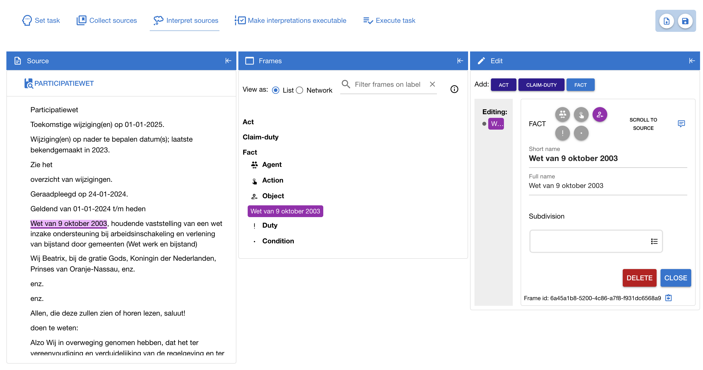

# Interpretation editor | GUI

This folder contains the code for the user interface of the interpretation editor.

## User manual

TODO: add reference to user manual

## Data model

The tool uses an internal data structure that differs slightly from the JSON and RDF format in which the interpretations are stored.

The definitions of the classes used in the tool can be found in the folder `model`. The main classes are:

- `frame` This is a class representing a frame. It is the superclass of `act`, `fact`, and `claim_duty`. Each frame has the following attributes:
    - _id_ A unique id, generated when a frame is instantiated.
    - _typeId_ The name of the frame's type (one of 'fact','act','claim_duty')
    - _shortName_ A short label as displayed in the frame list.
    - _fullName_ The full name of the frame, displayed when hovering the frame in the frame list.
    - _annotations_ A list of `annotation` objects. See below for a detailed explanation of an annotation.
    - _comments_ A list of `comment` objects. These are remarks and considerations that the user can store as notes attached to the frame when creating the interpretation.
- `fact` A frame of type _fact_. In addition to the attributes inherited from `frame` it has:
    - _subTypeIds_ A possibly empty list of subtype id's. A fact can have zero, one, or more subtypes. Valid subtype id's are: 'agent', 'action', 'object', 'duty', 'condition'.
    - _subDivision_ An object of type `booleanConstruct` representing a subdivision of a fact. A fact can consist of other facts, but not necessarily. This attribute speficies how a fact is subdivided. See below for an explanation of a booleanConstruct.
- `act` A frame of type _act_. In addition to the attributes inherited from `frame` it has attributes for the roles of an act frame:
    - _action_ An object of type `fact` representing the action of an act
    - _actor_ An object of type `fact` representing the actor of an act
    - _object_ An object of type `fact` representing the object of an act
    - _precondition_ A `booleanConstruct` representing a fact or a combination of facts that form the precondition of an act 
    - _recipient_ An object of type `fact` representing the recipient of an act
    - _creates_ A list of zero or more `fact` objects created by an act
    - _terminates_ A list of zero or more `fact` objects terminated by an act

    In addition, an act has auxiliary attributes, not part of the data model:
    - _activeField_ The role of the act that is currently selected by the user
    - _generateLabelAutomatically_ If true, labels (_shortName_ and _fullName_) are generated automatically for the act
- `claimduty` A frame of type _claim-duty_. In addition to the attributes inheried from `frame` it has attributes for the reles of a claim-duty frame:
    - _duty_ An object of type `fact` representing the duty of a claim-duty
    - _claimant_ An object of type `fact` representing the claimant of a claim-duty
    - _holder_ An object of type `fact` representing the holder of a claim-duty

    In addition, a claim-duty has auxiliary attributes, not part of the data model:
    - _activeField_ The role of the claim-duty that is currently selected by the user
    - _generateLabelAutomatically_ If true, labels (_shortName_ and _fullName_) are generated automatically for the claim-duty

- `booleanConstruct` This class is used to specify a combination of frames. Frames are combined using functions, e.g. boolean operators like OR and AND. A `booleanConstruct` can be nested: it can combine other boolean constructs as in: `booleanConstruct_1` AND `booleanConstruct_2`. A `booleanConstruct` is a tree, where the leafs are _frames_ and all other nodes are _booleanConstructs_. It has the following attributes:
    - _frame_ This attributes holds a frame in case the booleanConstruct is a leaf, i.e. it is a single frame, not a combination of frames.
    - _children_ If the booleanConstruct is not a leaf (i.e. _frame_ is not null), this attribute is a list of booleanConstruct objects.
    - _operatorToJoinChildren_ The function with which to join the childeren, e.g. a boolean operator.
    - _isNegated_ If a frame is specified, this attribute tells whether or not the frame should be negated (i.e. the unary boolean function NOT is applied)

- `sourceDocument` This class holds a source document, e.g. the content of a law like the _Participatiewet_. Its constructor reads a jsonLD object and parses it into a nested structure of sentence objects. The leafs of this structure are individual sentences. The nodes higher in the hierarchy represent paragraphs, chapters, etc. It has these attributes:
    - _title_ The title of the source document
    - _sentenceTree_ A nested structure of `sentence` objects

- `sentence` The text of a sentence, or a heading (i.e. label of a heading, paragraph, section). The text of a sentence (or heading) is divided in snippets (see below) so that an annotation of a frame can contain _part_ of a sentence, and not necessarily complete sentences. Its most important attributes are:
    - _sourceDocument_ The `sourceDocument` this sentence is part of
    - _snippets_ A list of `snippet` objects that comprises this sentence
    - _children_ If this sentence is a section or other higher-level element in the document: a list of `sentence` objects that together form this section
    

- `snippet` An atomic piece of text. The text is specified as a character range in a sentence. The snippet refers to all annotations that it is part of. Its attributes are:
    - _id_ A unique identifier
    - _sentence_ The sentence object the snippet is part of
    - _characterRange_ The start and end index of the character range within the sentence
    - _annotations_ The annotations that the snippet is part of

- `annotation` This object links snippets to a frame. The snippets form the annotation of the frame. Its attributes are:
    - _id_ A unique identifier
    - _frame_ The `frame` object that this is the annotation of
The link between snippets and annotation is stored in the snippets, see above. Auxiliary attributes used for drawing coloured lines under the source text are:
    - _nrSnippets_ Number of snippets of this annotation
    - _verticalPosition_ The vertical position of the coloured line that marks this annotation in the source text
